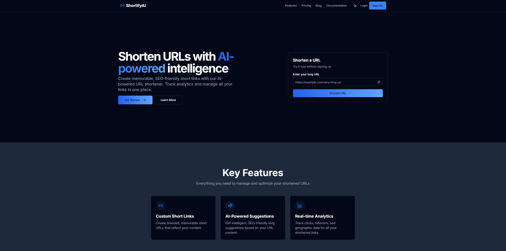
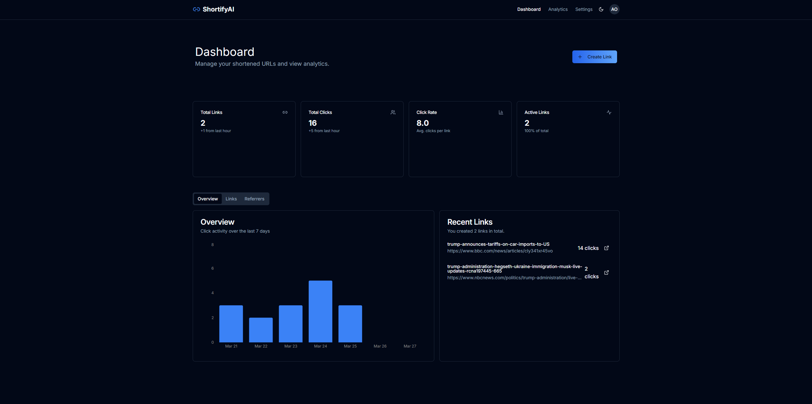
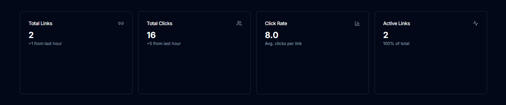
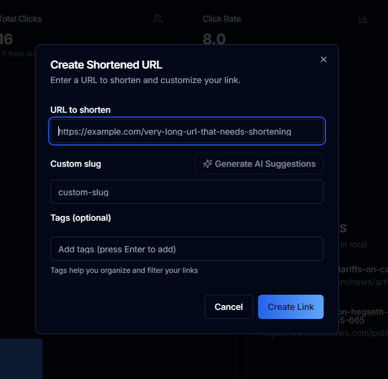

## 📝 Project Description

ShortifyAI is an intelligent URL shortening SaaS web application that combines the power of AI with robust analytics. It allows users to create memorable, SEO-friendly short links with custom slugs, track comprehensive analytics in real-time, and manage all their links in one centralized dashboard. Built with modern web technologies, ShortifyAI provides a seamless experience for both casual users and businesses looking to optimize their link management and tracking capabilities.

## ✨ Features

- **URL Shortening**: Create shortened URLs with just a few clicks
- **Custom Slug Creation**: Personalize your shortened URLs with custom slugs
- **AI-Powered Slug Suggestions**: Get intelligent, SEO-friendly slug suggestions based on your URL content
- **Real-time Analytics**: Track clicks, referrers, geographic data, and more for all your shortened links
- **Comprehensive Dashboard**: View all your links, analytics, and performance metrics in one place
- **User Authentication**: Secure sign-up and login with email/password or Google authentication
- **Profile Management**: Update your profile information and preferences
- **Theme Customization**: Choose between light, dark, or system theme
- **Custom Domains**: Use your own branded domains for shortened URLs
- **API Access**: Programmatically create and manage links with our API
- **Responsive Design**: Seamless experience across desktop, tablet, and mobile devices
- **Tag Management**: Organize links with custom tags for easy filtering
- **Link Management**: Edit, delete, and manage all your shortened URLs


## 🛠️ Technologies Used

### Frontend

- **Next.js 15**: React framework for server-side rendering and static site generation
- **React 19**: JavaScript library for building user interfaces
- **TypeScript**: Typed superset of JavaScript
- **Tailwind CSS**: Utility-first CSS framework
- **shadcn/ui**: Reusable UI components built with Radix UI and Tailwind CSS
- **Lucide React**: Beautiful, consistent icon set
- **Recharts**: Composable charting library for data visualization


### Backend

- **Firebase**: Backend-as-a-Service platform

- **Firestore**: NoSQL database for storing links and user data
- **Firebase Authentication**: User authentication and management
- **Firebase Functions**: Serverless functions for API endpoints


### Development Tools

- **ESLint**: JavaScript linting utility
- **Prettier**: Code formatter
- **Git**: Version control system
- **npm**: Package manager


## 🚀 Installation

Follow these steps to set up ShortifyAI locally:

1. **Clone the repository**

```shellscript
git clone https://github.com/yourusername/shortifyai.git
cd shortifyai
```


2. **Install dependencies**

```shellscript
npm install
```


3. **Set up environment variables**

Create a `.env.local` file in the root directory with the following variables:

```plaintext
NEXT_PUBLIC_FIREBASE_API_KEY=your_firebase_api_key
NEXT_PUBLIC_FIREBASE_AUTH_DOMAIN=your_firebase_auth_domain
NEXT_PUBLIC_FIREBASE_PROJECT_ID=your_firebase_project_id
NEXT_PUBLIC_FIREBASE_STORAGE_BUCKET=your_firebase_storage_bucket
NEXT_PUBLIC_FIREBASE_MESSAGING_SENDER_ID=your_firebase_messaging_sender_id
NEXT_PUBLIC_FIREBASE_APP_ID=your_firebase_app_id
NEXT_PUBLIC_USE_FIREBASE_EMULATORS=false
```


4. **Run the development server**

```shellscript
npm run dev
```


5. **Open your browser**

Navigate to [http://localhost:3000](http://localhost:3000) to see the application running.


## 📖 Usage

### Shortening a URL

1. Navigate to the homepage or dashboard
2. Enter the long URL you want to shorten in the input field
3. (Optional) Click "Generate AI Suggestions" to get AI-powered slug suggestions
4. (Optional) Enter a custom slug or select one of the AI suggestions
5. (Optional) Add tags to organize your link
6. Click "Create Link" or "Shorten URL"
7. Copy the shortened URL to share it


### Viewing Analytics

1. Log in to your account
2. Navigate to the Dashboard
3. View the overview of all your links' performance
4. Click on the "Analytics" tab for more detailed insights
5. Explore different metrics like clicks, referrers, geographic data, etc.


### Managing Links

1. Log in to your account
2. Navigate to the Dashboard
3. Click on the "Links" tab to see all your links
4. Use the search bar or tag filters to find specific links
5. Click on the edit icon to modify a link
6. Click on the delete icon to remove a link


### Customizing Settings

1. Log in to your account
2. Navigate to Settings(coming soon)
3. Explore different settings tabs:

1. Profile: Update your personal information (coming soon)
2. Appearance: Change theme preferences(coming soon)
3. Security: Update password and security settings (coming soon)
4. Domains: Manage custom domains (coming soon)
5. API: Get API keys and documentation (coming soon)
6. Integrations: Connect with third-party services (coming soon)


## 📁 Project Structure

```plaintext
shortifyai/
├── app/                    # Next.js app directory
│   ├── dashboard/          # Dashboard pages
│   ├── login/              # Authentication pages
│   ├── signup/             # User registration
│   ├── s/                  # URL redirection
│   ├── layout.tsx          # Root layout
│   └── page.tsx            # Homepage
├── components/             # Reusable React components
│   ├── analytics/          # Analytics-related components
│   ├── settings/           # Settings-related components
│   ├── ui/                 # UI components (shadcn/ui)
│   └── ...                 # Other components
├── contexts/               # React contexts
│   ├── auth-context.tsx    # Authentication context
│   └── theme-context.tsx   # Theme context
├── hooks/                  # Custom React hooks
│   ├── use-analytics.ts    # Analytics hook
│   ├── use-links.ts        # Links management hook
│   └── ...                 # Other hooks
├── lib/                    # Utility functions and libraries
│   ├── ai-utils.ts         # AI-related utilities
│   ├── firebase.ts         # Firebase configuration
│   └── utils.ts            # General utilities
├── public/                 # Static assets
├── types/                  # TypeScript type definitions
├── .env.local              # Environment variables
├── next.config.js          # Next.js configuration
├── package.json            # Project dependencies
├── tailwind.config.js      # Tailwind CSS configuration
└── tsconfig.json           # TypeScript configuration
```

## 🔌 API Endpoints

ShortifyAI does not provide a RESTful API for programmatic access to its features. Here are the main endpoints (coming soon):

### Authentication

- **POST /api/auth/register**

- Create a new user account
- Request body: `{ email, password }`
- Response: `{ success, userId, message }`


- **POST /api/auth/login**

- Authenticate a user
- Request body: `{ email, password }`
- Response: `{ success, token, userId }`


### Links

- **GET /api/links**

- Get all links for the authenticated user
- Headers: `Authorization: Bearer {token}`
- Response: `{ links: [Link] }`


- **POST /api/links**

- Create a new shortened link
- Headers: `Authorization: Bearer {token}`
- Request body: `{ originalUrl, slug?, tags? }`
- Response: `{ success, link: Link }`


- **PUT /api/links/:id**

- Update an existing link
- Headers: `Authorization: Bearer {token}`
- Request body: `{ slug?, tags? }`
- Response: `{ success, link: Link }`


- **DELETE /api/links/:id**

- Delete a link
- Headers: `Authorization: Bearer {token}`
- Response: `{ success, message }`


### Analytics

- **GET /api/analytics/overview**

- Get overview analytics for all links
- Headers: `Authorization: Bearer {token}`
- Response: `{ totalClicks, totalLinks, clickRate, activeLinks }`


- **GET /api/analytics/links/:id**

- Get detailed analytics for a specific link
- Headers: `Authorization: Bearer {token}`
- Response: `{ clicks, referrers, countries, devices, browsers }`


## 🗄️ Database Schema

ShortifyAI uses Firebase Firestore as its database. Here's the schema:

### Users Collection

```plaintext
users/
├── {userId}/
│   ├── email: string
│   ├── displayName: string (optional)
│   ├── photoURL: string (optional)
│   ├── createdAt: timestamp
│   └── lastLogin: timestamp
```

### Links Collection

```plaintext
links/
├── {linkId}/
│   ├── originalUrl: string
│   ├── shortUrl: string
│   ├── slug: string
│   ├── userId: string (reference to users/{userId})
│   ├── createdAt: timestamp
│   ├── clicks: number
│   ├── lastClickedAt: timestamp (optional)
│   ├── tags: array (optional)
│   └── isPublic: boolean
```

### Analytics Collection

```plaintext
analytics/
├── {analyticsId}/
│   ├── linkId: string (reference to links/{linkId})
│   ├── slug: string
│   ├── timestamp: timestamp
│   ├── referrer: string
│   ├── userAgent: string
│   ├── language: string
│   ├── screenSize: string
│   ├── country: string (optional)
│   ├── city: string (optional)
│   ├── device: string (optional)
│   ├── browser: string (optional)
│   └── os: string (optional)
```

## 🔐 Authentication

ShortifyAI uses Firebase Authentication for user management. The application supports:

1. **Email/Password Authentication**

1. Users can sign up with their email and password
2. Password reset functionality is available (coming soon)
3. Email verification is supported


2. **Google Authentication**

1. Users can sign in with their Google accounts
2. Profile information is automatically imported


3. **Authentication Flow**

1. User signs up or logs in
2. Firebase Authentication verifies credentials
3. Upon successful authentication, a user document is created/updated in Firestore
4. The user is redirected to the dashboard


4. **Security**

1. Firebase Authentication handles secure password storage
2. JWT tokens are used for API authentication
3. Security rules in Firestore ensure users can only access their own data


## 👥 Contributing

We welcome contributions to ShortifyAI! Here's how you can help:

1. **Fork the repository**
2. **Create a feature branch**

```shellscript
git checkout -b feature/amazing-feature
```


3. **Commit your changes**

```shellscript
git commit -m 'Add some amazing feature'
```


4. **Push to the branch**

```shellscript
git push origin feature/amazing-feature
```


5. **Open a Pull Request**


### Coding Standards

- Follow the existing code style
- Write meaningful commit messages
- Add appropriate comments to your code
- Write tests for new features
- Ensure all tests pass before submitting a PR


## 📄 License

This project is licensed under the MIT License - see the [LICENSE](LICENSE) file for details.

## 📞 Contact

- **Website**: [shortifyai.rsstudios.dev](https://shortifyai.rsstudios.dev)
- **GitHub**: [github.com/Aoun-Abu-Hassan/ShortifyAI](https://github.com/Aoun-Abu-Hassan/ShortifyAI)
- **Email**: [aoun@rsstudios.dev](mailto:aoun@rsstudios.dev)
- **Discord**: [discord.gg/Dxg4q4j3GB](https://discord.gg/Dxg4q4j3GB)


## 🙏 Acknowledgments

- [Next.js](https://nextjs.org/) - The React framework
- [Firebase](https://firebase.google.com/) - Backend services
- [Tailwind CSS](https://tailwindcss.com/) - CSS framework
- [shadcn/ui](https://ui.shadcn.com/) - UI components
- [Lucide React](https://lucide.dev/) - Icon set
- [Recharts](https://recharts.org/) - Charting library
- All the open-source contributors whose libraries made this project possible


## 📸 Screenshots

### Homepage




### Dashboard



### Analytics



### Link Creation



## 🔗 Live Demo

Check out the live demo at [shortifyai.rsstudios.dev](https://shortifyai.rsstudios.dev)

---

Built with ❤️ by [Aoun Abu Hassan](https://github.com/Aoun-Abu-Hassan)